# ♠ ♥ ♦ ♣BlackjackBlast!♣ ♦ ♥ ♦ ♠
[**click here fo live page**](https://black-jack-blast-1c6cf6d1efb8.herokuapp.com/)

Blackjack, also known as 21, is a popular card game played in casinos worldwide. The game is played between the player and the dealer. The objective is to obtain a hand value as close to 21 as possible without exceeding it.

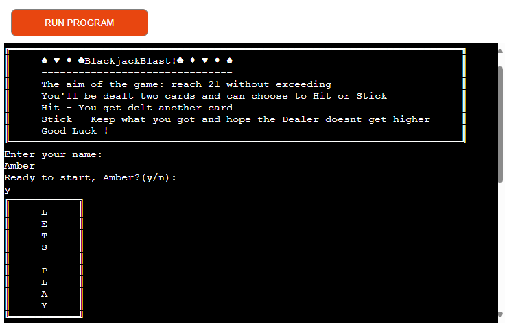

* Setup: Players and the dealer are dealt two cards each, one of dealers first initial cards faced down.
* Objective: Get a hand closer to 21 than the dealer's without exceeding it.
* Gameplay: Players can choose to "hit" (get another card) or "stand" (keep current hand).
* Dealer's Turn: The dealer hits until reaching 17 or higher.
* Winning: Players win if their hand beats the dealer's without busting (going over 21).

## FEATURES
### Existing

#### Welcome Box
* At the page's top, a boxed section features the underlined title and a brief game aim description, enhancing user experience by separating it from the game area.

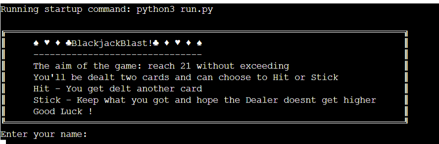

#### Player's Name Request
* Below the welcome box, there's a prompt asking users to enter their name. If left blank, it's considered invalid and prompts the user to enter a name. The game initiates only after a valid name is entered.

#### Player Ready
* Once the player has entered their name successfully, they will be prompted with a "Ready to play, {their name}?" message (Y/N):

If "N/n" is selected, a "Goodbye" message ends the script.
If "Y/y" is selected, a "Let's Go" message appears, initiating the game.
Any response other than "Y" or "N" is considered invalid, and the player is alerted to press the correct key to continue.

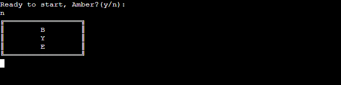
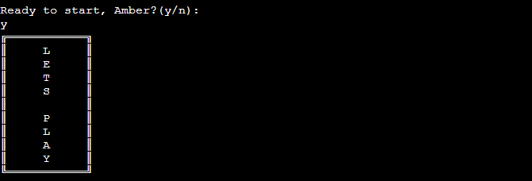
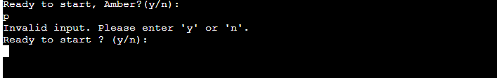

#### First Deal
* Two rows will show: the top for the player's hand and the bottom for the dealer's. Both initially have two cards, but one of the dealer's is face down. Labels above the cards identify whose hand it is, and totals below show the combined value of each hand

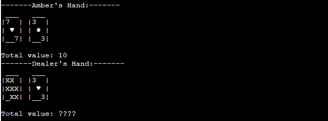

#### Hit or Stick ?
* Players are asked to "Hit" or "Stick" (H/S)(h/s):

Choosing "Hit" gives them another card, updating their total.
They can keep hitting if their total is under 21.

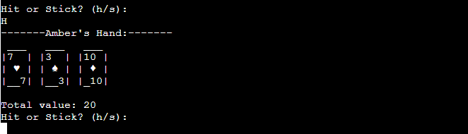

"Stick" keeps their current total, revealing the dealer's cards for their turn.

Any input other than "H/s" or "S/s" will be deemed invalid, and the player will be notified to choose a valid option

Note: Aces can be 1 or 11.

#### Winner messages
* The game displays messages indicating the winner or if someone has busted

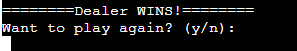

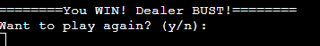

#### Play Again?

Once the game concludes, the player is prompted to choose whether they want to play another game (Y/N).

* Selecting "Y/y" clears the screen and prompts the user to enter their name again, restarting the game.
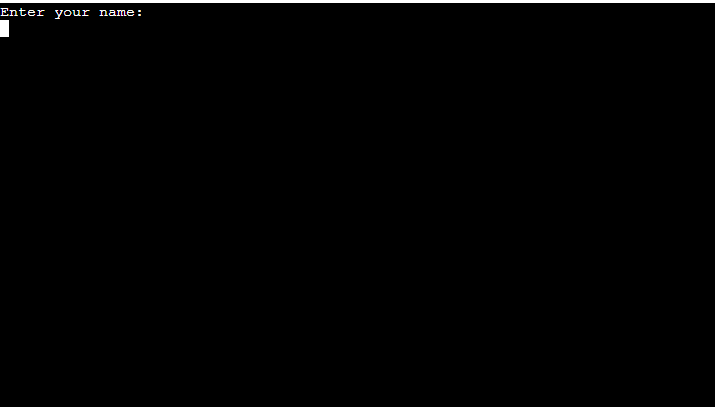

* If "N" is chosen, a goodbye message ends the script.
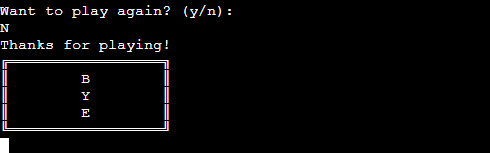

* Any input other than "Y" or "N" results in a notification prompting the user to enter a valid option

### Future Features
* Apply color to the import statement and enhance the appearance of the cards to make them more visually striking. Unfortunately, due to time constraints, this feature couldn't be implemented.
* Add more features such as 5 card trick and other elements of the game to make it more complex.

## UX

### User Stroies 

* As a player, I want to be dealt two cards at the beginning of each round so that I can start playing Blackjack.
* As a player, I want to be able to hit (receive another card) during my turn so that I can try to improve my hand.
* As a player, I want to be able to stand (end my turn) during my turn so that I can keep my current hand without receiving additional cards.
* As a player, I want to see the total value of my hand so that I can make informed decisions during the game.
* As a player, I want to be notified if I bust (exceed a hand value of 21) so that I know when I've lost the round.
* As a player, I want to be notified when the dealer busts so that I know when I've won the round.

## DATA MODEL

### Flowchart
I have used [**Lucidchart**](https://www.lucidchart.com) 

I devised my initial strategy using a flowchart, aiding in the development and coding of the application's logic.

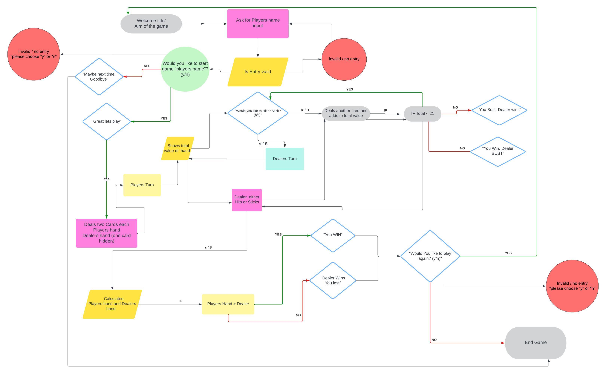

## TESTING

### Validator Testing 
* Python code tested and no significant errors shown in results. 

Code passed through: [**CI Python Linter**](https://pep8ci.herokuapp.com/https://raw.githubusercontent.com/)

  Validated (run.py): 
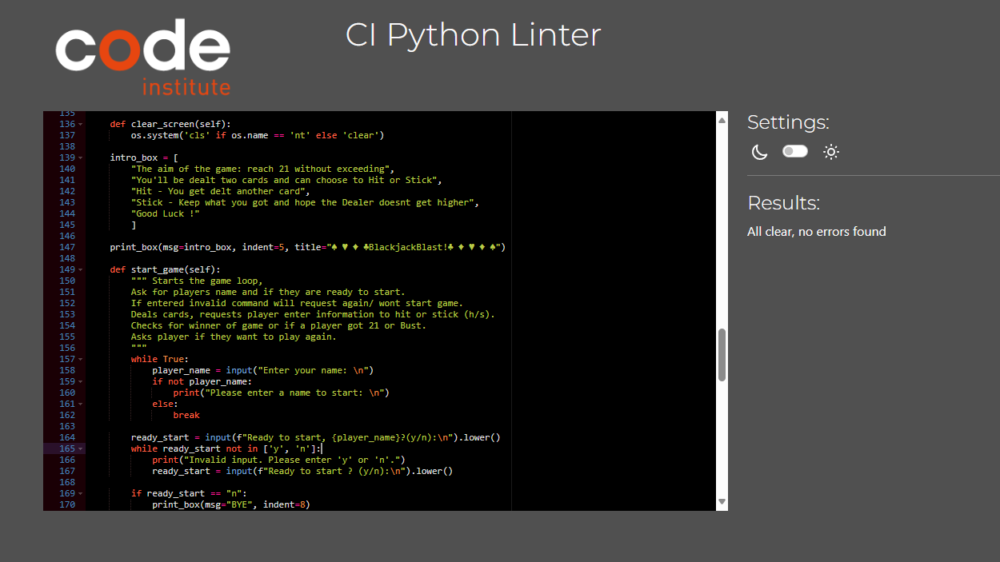

### Functional Testing

I have used [**Lucidchart**](https://www.lucidchart.com) to record and present my functional testing.

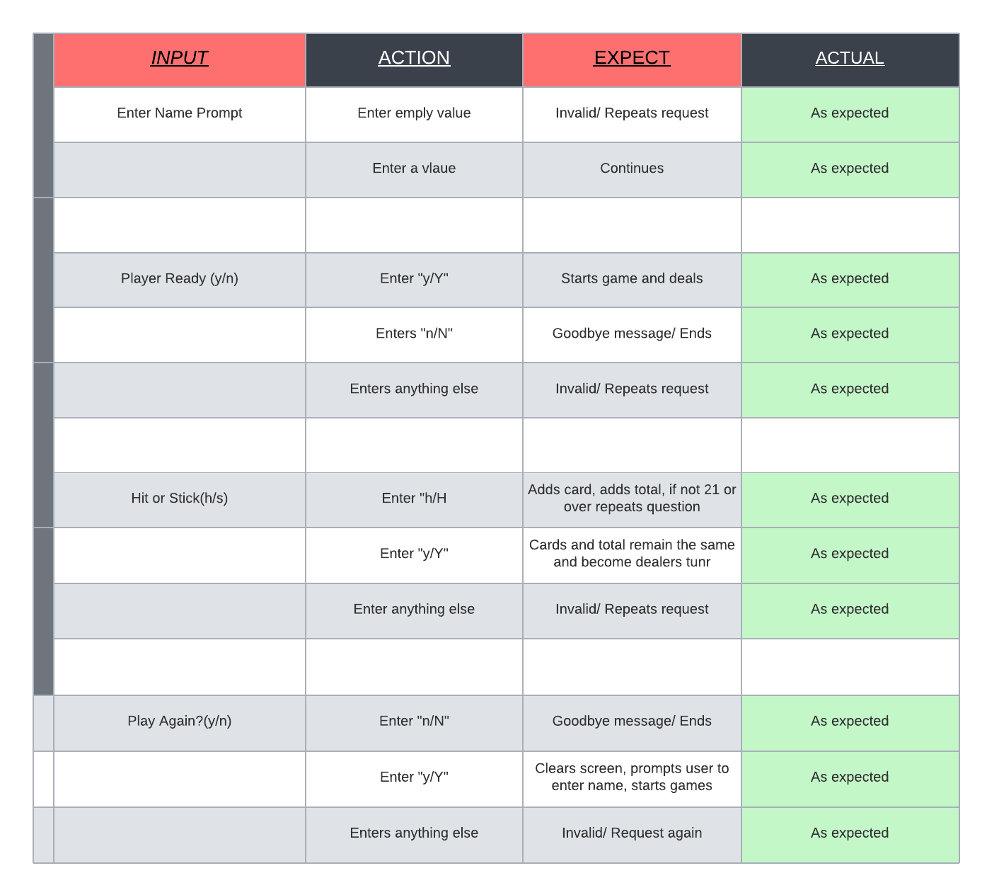

## Tools and Technologies
* CodeAnywhere - Platform used making code
* Python - Programming language (back end)
* Github - Store code online
* Heroku - Deploy the app 
* Lucidchart - Planning & Testing/ building Flowchart at planning stage & recording stage
* CI Python Linter - Validate Code 

### Imports

Imported Python packages and external packages:
  * `os` : To clear the terminal when starting game again
  * `sys` : For exiting the program
  * `random`: To randomly deal cards

### Version

The code has been uploaded to the remote repository on GitHub using the following Git commands:

* git add . - to stage files for commit
* git commit -m "message" - to commit the code to the local repository
* git push - the final command to push the committed code to the remote GitHub repository.
   

## Deployment
The app has been showcased using a template provided by Code Institute to enable others to test the code.

Blackjack Blast has been deployed on Heroku with the following steps:

* Create a Heroku account (detailed guide here).
* Click 'New' at the top right.
* Select 'Create new app'.
* Provide a name for your app and choose your region from the dropdown.
* Click 'Create new app'.
* Navigate to the 'Settings' tab (this is important before deployment).
* Under the 'Config Vars' section, add: PORT as key and 8000 as value.
* Scroll down to the 'Buildpacks' section.
* Click 'Add buildpack'.
* Add Python as the first dependency and save changes.
* Add node.js as a second dependency and save again.

* Now, go to the 'Deploy' tab at the top.   

* Choose 'GitHub' as the 'Deployment method'.
* Enter the project name from GitHub and click 'search'.
* Scroll down and select the manual deployment method.
* Auto deployment method is also selected to update the project automatically every time code is pushed from Gitpod.
* You can now view the app, ready and running.

## CREDITS

Helpful sites
* Information on import os -- https://www.geeksforgeeks.org/clear-screen-python/
* Information on pip installed colored -- https://pypi.org/project/colored/ -- Currently unused for this project
* Information on pop() method -- https://www.w3schools.com/python/ref_list_pop.asp
* Information on enumerate() function -- https://www.w3schools.com/python/ref_func_enumerate.asp#gsc.tab=0
* Syntax information for randint() method -- https://www.geeksforgeeks.org/python-randint-function/

Site of Inspo
* How to create card form for the cards in the console -- https://inventwithpython.com/bigbookpython/project4.html
* Initial understanding and inspo for games code logic and layout -- https://www.youtube.com/watch?v=aryte85bt_M&t=28s
* Initial understanding and inspo for games code logic and layout -- https://www.youtube.com/watch?v=mpL0Y01v6tY

* Origial code used from stackoverflow.com (with minor tweeks) -- For the boxed intro -- https://stackoverflow.com/questions/39969064/how-to-print-a-message-box-in-python

Code Institute
* For walkthrough project and template used to showcase project on app -- https://learn.codeinstitute.net/courses/course-v1:CodeInstitute+LS101+2021_T1/courseware/293ee9d8ff3542d3b877137ed81b9a5b/071036790a5642f9a6f004f9888b6a45/3?activate_block_id=block-v1%3ACodeInstitute%2BLS101%2B2021_T1%2Btype%40vertical%2Bblock%4062d6d910267841508ad83128b91f103e
